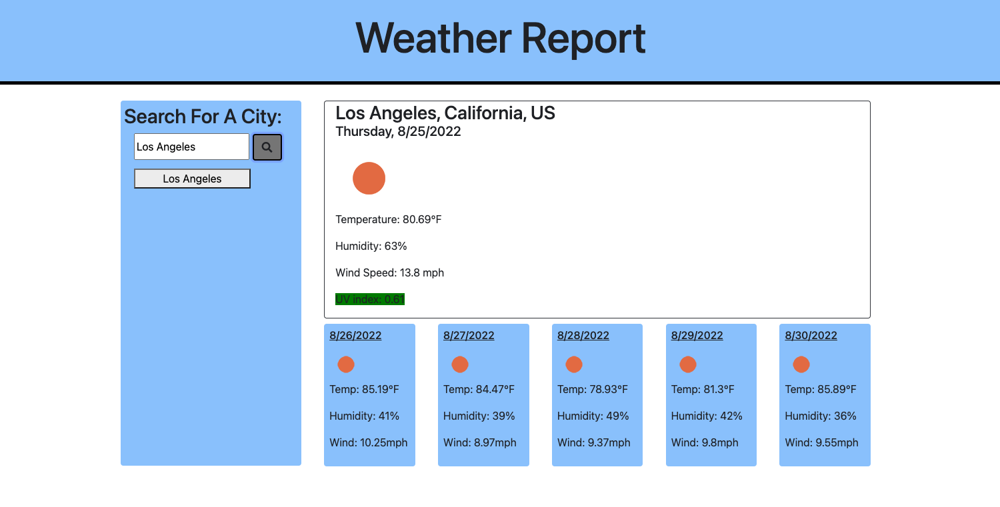

# weather-dashboard

## Description

The motivation behind this project was to give users the ability to search for the weather in any city they would like. This weather dashboard gives the current weather in the city of the users choice as well as a five day weather report for that city. This application saves the previous searches in local storage and displays them under the search bar. If you would like to view the weather for a previously searched city you may click on the button associated with that city and you will be given the results again. 

Building this application I learned how to fetch data from an API, display that data, and create elements dynamically through javascript. I also learned how to set classes through javascript which allowed me to hide and unhide certain elements.

## Usage

https://3enhobson.github.io/weather-dashboard/
    

    
